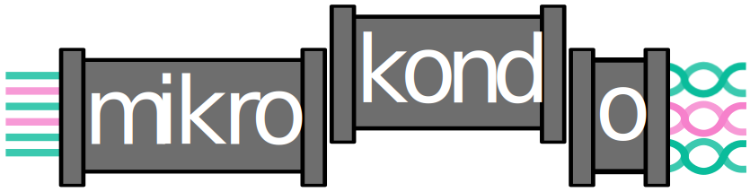

<!-- [](https://doi.org/10.5281/zenodo.XXXXXXX) -->

[](https://www.nextflow.io/)
<!-- [](https://docs.conda.io/en/latest/) -->
[](https://www.docker.com/)
[](https://sylabs.io/docs/)
<!-- [](https://tower.nf/launch?pipeline=https://github.com/mk-kondo/mikrokondo) -->

## What is mikrokondo?
Mikrokondo is a tidy workflow for performing routine bioinformatic tasks like, read pre-processing, assessing contamination, assembly and quality assessment of assemblies. It is easily configurable, provides dynamic dispatch of species specific workflows and produces common outputs.

## Is mikrokondo right for me?
Mikrokondo takes in either, Illumina, Nanopore or Pacbio data (Pacbio data only partially tested). You can also use mikrokondo for hybrid assemblies or even pass it pre-assembled assembled genomes. Additionally, mikrokondo required minimal upfront knowledge of your sample.

 Installation

## Installing Nextflow
Nextflow is required to run mikrokondo, but fortunately it is not too hard to install (Linux is required). The instructions for installing Nextflow can be found at either either resource: [Nextflow Home](https://www.nextflow.io/) or  [Nextflow Documentation](https://www.nextflow.io/docs/latest/getstarted.html#installation)

## Container Engine
Nextflow and Mikrokondo only supports running the pipeline using containers such as: Docker, Singularity (now apptainer), podman, gitpod, sifter and charliecloud. Currently only usage with Singularity has been tested, but support for each of the container services exists. Note: Singularity was adopted by the Linux Foundation and is now called Apptainer. Singularity still exists, but it is likely newer installs will use Apptainer.

## Docker or Singularity?
Docker or Singularity (Apptainer) Docker requires root privileges which can can make it a hassle to install on computing clusters (there are work arounds). Apptainer/Singularity does not, so running the pipeline using Apptainer/Singularity is the recommended method for running the pipeline.

### Issues
Containers are not perfect, below is a list of some issues you may face using containers in mikrokondo, fixes for each issue will be detailed here as they are identified.
- Exit code 137, likely means your docker container used to much memory.

## Dependencies
Besides the Nextflow run time (requires Java), and container engine the dependencies required by mikrokondo are fairly minimal requiring only Python 3.10 (more recent Python versions will work as well) to run. Currently mikrokondo has been tested with fully with Singularity (partially with Apptainer, containers all work not all workflow paths tested) and partially tested with Docker (not all workflow paths tested). **Dependencies can be installed with Conda (e.g. Nextflow and Python)


## Resources to download
- [GTDB Mash Sketch](https://zenodo.org/record/8408361): required for speciation and determination if sample is metagenomic
- [Decontamination Index](https://zenodo.org/record/8408557): Required for decontamination of reads (it is simply a minimap2 index)
- [Kraken2 nt database](https://benlangmead.github.io/aws-indexes/k2): Required for binning of metagenommic data and is an alternative to using Mash for speciation
- [Bakta database](https://zenodo.org/record/7669534): Running Bakta is optional and there is a light database option, however the full one is recommended. You will have to unzip and un-tar the database for usage.

### Fields to update with resources
The above downloadable resources must be updated in the following places in your `nextflow.config`. The spots to update in the params section of the `nextflow.config` are listed below:

```
// Bakta db path, note the quotation marks
bakta {
    db = "/PATH/TO/BAKTA/DB"
}

// Decontamination minimap2 index, note the quotation marks
r_contaminants {
    mega_mm2_idx = "/PATH/TO/DECONTAMINATION/INDEX"
}

// kraken db path, not the quotation marks
kraken {
    db = "/PATH/TO/KRAKEN/DATABASE/"
}

// GTDB Mash sketch, note the quotation marks
mash {
    mash_sketch = "/PATH/TO/MASH/SKETCH/"
}

```

## TODOs
- [ ] Provide a script for database downloads
- [ ] Update details in documentation
- [ ] Wait for allele caller


## Citations

<!-- TODO nf-core: Add citation for pipeline after first release. Uncomment lines below and update Zenodo doi and badge at the top of this file. -->
<!-- If you use  mk-kondo/mikrokondo for your analysis, please cite it using the following doi: [10.5281/zenodo.XXXXXX](https://doi.org/10.5281/zenodo.XXXXXX) -->

<!-- TODO nf-core: Add bibliography of tools and data used in your pipeline -->

An extensive list of references for the tools used by the pipeline can be found in the [`CITATIONS.md`](CITATIONS.md) file.

This pipeline uses code and infrastructure developed and maintained by the [nf-core](https://nf-co.re) community, reused here under the [MIT license](https://github.com/nf-core/tools/blob/master/LICENSE).

> **The nf-core framework for community-curated bioinformatics pipelines.**
>
> Philip Ewels, Alexander Peltzer, Sven Fillinger, Harshil Patel, Johannes Alneberg, Andreas Wilm, Maxime Ulysse Garcia, Paolo Di Tommaso & Sven Nahnsen.
>
> _Nat Biotechnol._ 2020 Feb 13. doi: [10.1038/s41587-020-0439-x](https://dx.doi.org/10.1038/s41587-020-0439-x).
