# Welcome to mikrokondo!

## What is mikrokondo?
Mikrokondo is a tidy workflow for performing routine bioinformatic assessment of sequencing reads and assemblies, such as: read pre-processing, assessing contamination, assembly, quality assessment of assemblies, and pathogen-specific typing. It is easily configurable, provides dynamic dispatch of species specific workflows and produces common outputs.

## What is the target audience?
This workflow can be used in sequencing and reference laboratories as a part of an automated quality and initial bioinformatics assessment protocol.

## Is mikrokondo right for me?
Mikrokondo is purpose built to provide sequencing and clinical laboratories with an all encompassing workflow to provide a standardized workflow that can provide the initial quality assessment of sequencing reads and assemblies, and initial pathogen-specific typing. It has been designed to be configurable so that new tools and quality metrics can be easily incorporated into the workflow to allow for automation of these routine tasks regardless of pathogen of interest. It currently accepts Illumina, Nanopore or Pacbio (Pacbio data only partially tested) sequencing data. It is capable of hybrid assembly or accepting pre-assembled genomes.

This workflow will detect what pathogen(s) is present and apply the applicable metrics and genotypic typing where appropriate, generating easy to read and understand reports. If your group is regularly sequencing or analyzing genomic sequences, implementation of this workflow will automate the hands-on time time usually required for these common bioinformatic tasks.

## Workflow Schematics (Subject to change)

