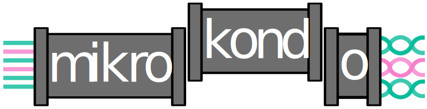

# Welcome to mikrokondo!

## What is mikrokondo?
Mikrokondo is a tidy workflow for performing routine bioinformatic tasks like, read pre-processing, assessing contamination, assembly and quality assessment of assemblies. It is easily configurable, provides dynamic dispatch of species specific workflows and produces common outputs.

## Is mikrokondo right for me?
Mikrokondo takes in either, Illumina, Nanopore or Pacbio data (Pacbio data only partially tested). You can also use mikrokondo for hybrid assemblies or even pass it pre-assembled assembled genomes. Additionally, mikrokondo required minimal upfront knowledge of your sample.

## Workflow Schematics (Subject to change)

